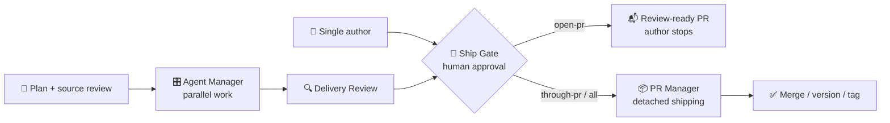
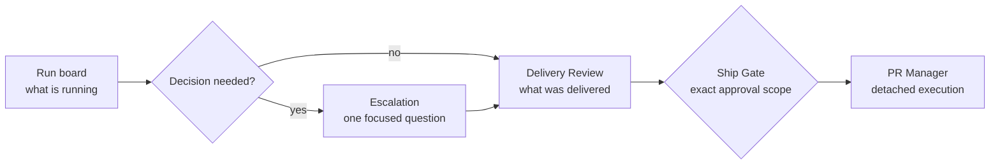

# agent-manager 🎛️

[](https://nodejs.org/)
[](#requirements)
[](LICENSE)

**One operator. Up to five isolated coding lanes. Explicit approval before anything ships.**

> **Why we built it**
>
> Agent Manager started as an internal tool for coordinating coding agents
> across our own repositories. In practice, three to five focused agents is
> the current sweet spot for this kind of work: enough parallelism to matter,
> but still small enough for one operator to understand and review.
>
> This is a deliberately focused tool. More advanced orchestration platforms
> exist, but if you want a straightforward way to run multiple Claude Code or
> Codex harnesses in isolated worktrees, Agent Manager provides the core loop.
> Its optional PR Manager and Ship Gate flow also keeps review, approval, CI,
> and shipping explicit, which reduces the operator's cognitive load.

agent-manager is a detached CLI supervisor for Claude Code and Codex CLI. It
runs parallel work in isolated Git worktrees while the host chat stays free for
decisions, questions, and review.

## Three components, three clear jobs

| Component | What it is | Owns | Does not own |
|---|---|---|---|
| **[🎛️ Agent Manager — core](skills/agent-manager/SKILL.md)** | CLI supervisor + host skill | planning evidence, lane isolation, bounded concurrency, questions, telemetry, integration, Delivery Review | source-system check-in, approval, or automatic shipping |
| **[📦 PR Manager — function](skills/pr-manager/SKILL.md)** | deterministic `agent-manager ship` phase + reporting skill | approved commit, push, pull request, CI wait, merge, version stamp, and tag | code authoring, approval decisions, policy bypasses, or GitHub Releases |
| **[🚦 Ship Gate — approval](skills/ship-gate/SKILL.md)** | standalone, model-neutral skill | the human approval board and exact authorized Git actions | orchestration or background execution |

Agent Manager is the product core. PR Manager is not another autonomous agent;
it is the core's detached shipping function. Ship Gate is deliberately
independent and can govern a normal single-agent pull request without Agent
Manager.



### Choose the smallest useful setup

| Need | Use |
|---|---|
| One agent should prepare a review-ready PR | 🚦 Ship Gate only (`open-pr`) |
| Several agents should build in parallel | 🎛️ Agent Manager, then 🚦 Ship Gate |
| Approved work should ship without blocking the host chat | All three |
| A human will handle GitHub after review | 🎛️ Agent Manager only; stop after Delivery Review |

## What the operator sees

The process is designed to make the next decision obvious. Agent Manager posts
the same structured boards in every supported harness, wakes the operator only
for meaningful changes or questions, and shows the exact authority requested
before any Git or shipping action. The examples below use illustrative data.



<details>
<summary><strong>1. Kickoff — a compact live run board</strong></summary>

## Agent Manager · Run board

| | |
|---|---|
| **runId** | `run-20260731-1432` |
| **repo** | `sample-app` |
| **state** | `running` |
| **target_dev_flow** | `formal` |
| **runtime** | `macos/arm64 (darwin) · zsh · spawn-no-shell` |
| **workflow** | `.agent-manager/profile-settings.yaml` |
| **plan** | `docs/plans/profile-settings.md` |
| **planning context** | `sha256:7d4b…91ac` |
| **started** | `2026-07-31 14:32 EDT` |
| **updated** | `2026-07-31 14:36 EDT` |
| **telemetry** | `$AGENT_MANAGER_RUNS_ROOT/run-20260731-1432/status.json` |

### Lanes

| Lane | State | Harness | Branch | Elapsed | Last activity |
|------|-------|---------|--------|---------|---------------|
| `contracts` | `done` | `codex` | `am/run-20260731-1432/contracts` | `94s` | Contract tests passed |
| `api` | `running` | `claude` | `am/run-20260731-1432/api` | `211s` | Updating request validation |
| `ui` | `running` | `codex` | `am/run-20260731-1432/ui` | `208s` | Adding the profile form |

### Actions

- Monitor (side terminal): `agent-manager monitor run-20260731-1432`
- Watch-signal (Master loop): `agent-manager watch-signal run-20260731-1432`
- Cancel: `agent-manager cancel run-20260731-1432`
- Logs: `$AGENT_MANAGER_RUNS_ROOT/run-20260731-1432/<lane>/stdout.log`

</details>

<details>
<summary><strong>2. Decision needed — one lane asks, independent work continues</strong></summary>

## Agent Manager · Escalation

| | |
|---|---|
| **runId** | `run-20260731-1432` |
| **lane** | `api` |
| **branch** | `am/run-20260731-1432/api` |
| **type** | `question` |
| **runtime** | `macos/arm64 (darwin) · zsh · spawn-no-shell` |

### Question

Should an empty display name preserve the current value or clear it?

### Options (if any)

- `A` — Preserve the current value
- `B` — Clear the value

### Waiting on

Operator reply in this chat. Other independent lanes may keep running.

### Reply command

- `agent-manager reply run-20260731-1432 api --message "Preserve the current value"`

</details>

<details>
<summary><strong>3. Delivery Review — evidence replaces lane self-reporting</strong></summary>

## Agent Manager · Delivery Review · Pass 1

| | |
|---|---|
| **runId** | `run-20260731-1432` |
| **eval_pass** | `1` |
| **correction_used** | `no` |
| **repo** | `sample-app` |
| **runtime** | `macos/arm64 (darwin) · zsh · spawn-no-shell` |
| **proposal** | `docs/plans/profile-settings.md` |
| **planning context** | `sha256:7d4b…91ac` |
| **reviewed** | `2026-07-31 14:51 EDT` |
| **verdict** | `accept` |

### Proposal checklist

| Item | Asked | Delivered? | Evidence (path / test / note) |
|------|-------|------------|-------------------------------|
| Shared contract | Define the profile update shape | `yes` | `src/contracts/profile.ts` · contract tests pass |
| API | Validate and save profile changes | `yes` | `src/api/profile.ts` · API tests pass |
| UI | Add an accessible profile form | `yes` | `src/ui/ProfileForm.tsx` · component tests pass |

### Cross-lane / contract checks

| Couple | OK? | Note |
|--------|-----|------|
| Contract ↔ API | `yes` | API imports the shared schema |
| Contract ↔ UI | `yes` | Form fields and defaults match the schema |
| Documentation ↔ behavior | `yes` | Empty display names preserve the current value |

### Gaps / feedback (by lane)

| Lane | Grade | Feedback for worker (actionable) |
|------|-------|----------------------------------|
| `contracts` | `A` | No changes requested |
| `api` | `A` | No changes requested |
| `ui` | `A` | No changes requested |

### Recommended next

- [x] Pass 1 `accept` → integrate if needed → **Ship Gate**
- [ ] Pass 1 `revise` / `relaunch` → one correction → Pass 2 report
- [ ] Pass 1 `reject` → release claims; do not ship
- [ ] Pass 2 `accept` / `accept-with-notes` → **Ship Gate**
- [ ] Pass 2 `reject` → stop; only the operator may order a new run

### Waiting on

Operator `accept` | `accept-with-notes` | `revise` | `relaunch` | `reject`

</details>

<details>
<summary><strong>4. Ship Gate — the operator approves an exact boundary</strong></summary>

## Ship Gate · Formal

| | |
|---|---|
| **Repo** | `sample-app` |
| **Branch** | `am/run-20260731-1432/integrate` |
| **Agent** | `Codex · Master Dev` |
| **Role** | `reviewer/integrator` |
| **Claim** | `n/a` |
| **Version** | at merge (not on branch) · current `1.4.0` |
| **Test gate** | `full` · suite **pass** |
| **CI** | `n/a` (not pushed yet) |
| **PR** | `none` |
| **check:version** | **n/a** (no stamp on branch) |

### Done

- [x] Work complete on branch
- [x] Tests (if required)
- [x] Claim held / scope clear (when claims apply)
- [ ] Code-review run (required before merge)
- [ ] Full stamp set ready on `main`
- [ ] `npm run check:version` pass on stamp
- [ ] CI quality green on stamp commit (before tag)

### Needs your OK

| Step | Action | Detail |
|------|--------|--------|
| COMMIT | waiting | `feat: add profile settings flow` |
| PUSH | waiting | `origin am/run-20260731-1432/integrate` |
| PR | waiting | open + `gh pr merge --auto --squash` |
| MERGE | waiting | only after CI and independent review are green |
| VERSION | waiting | on `main` after merge → `1.5.0` |
| TAG | waiting | only after stamp verification and CI |

### Approve — reply with one

| Reply | Does |
|-------|------|
| `all` | reviewer/integrator — commit → push → PR + auto-merge → release/stamp on `main` |
| `through-pr` | reviewer/integrator — commit → push → PR + auto-merge; version/tag later |
| `commit+push` | stop before PR |
| `commit` | commit only |
| `reject` | stop — add why |

After `through-pr` or `all`, PR Manager runs the approved steps in the
background and reports any CI or policy blocker. It never expands the approval
or invents a workaround.

</details>

These filled examples follow the canonical
[Agent Manager report templates](skills/agent-manager/reporting.md),
[Ship Gate boards](skills/ship-gate/SKILL.md), and
[PR Manager reports](skills/pr-manager/reporting.md).

## What the core provides

- One isolated Git worktree per lane
- Claude and Codex harnesses behind one workflow format
- Detached launch with authoritative `status.json`
- Automatic host runtime profile in doctor, prompts, telemetry, and shipping
- Fail-closed manager planning attestation with one frozen shared context packet
- Resumable `needs_input` and same-session `reply`
- Changed-file, scope, commit, and pull-request guardrails
- Up to five lanes with configurable bounded concurrency
- Fail-closed write-scope overlap validation and single-owner exceptions
- Dependency-aware lane scheduling from completed prerequisite branches
- Cross-lane changed-file checks and configured post-integration verification
- Host-neutral JSONL events and wake signals
- Evidence-backed Delivery Review before Ship Gate
- Optional integration branch without automatic merge
- Detached PR Manager for approved push, PR, CI, merge, version, and tag work
- Cursor skill installer and project-rule fallback

## Sandboxing and permissions

Agent Manager is not a sandbox. It launches each worker through its existing
agent CLI inside an isolated Git worktree. The underlying harness—such as
Claude Code or Codex—continues to enforce its native sandbox, approval,
authentication, and permission configuration.

Agent Manager passes the requested native permission mode and adds
orchestration guardrails such as file scopes, environment filtering,
Git-operation checks, and explicit shipping approval. Command-event inspection
is best-effort detection. These controls reduce accidental drift, but they do
not replace the harness security model or operating-system isolation.

Dangerous permission bypass is disabled by default. Enabling it requires two
explicit approvals: one in the workflow and one at launch.

Agent Manager is also not a terminal multiplexer, fleet dashboard, or automatic
merge service.

## Requirements

- Node.js 24 or later
- Git and GitHub CLI (`gh`) for the detached shipping phase
- Claude Code, Codex CLI, or both, already authenticated through their normal subscription CLI

## Install the core CLI

```bash
git clone https://github.com/Patchnet/agent-manager.git
cd agent-manager
npm ci
npm link
agent-manager --version
agent-manager doctor
```

You can also replace `agent-manager` in the examples with `node bin/agent-manager.mjs`.

`doctor` detects the authoritative host platform, architecture, shell, command
mode, and path style. Agent Manager injects the same profile into every lane
prompt and worker environment. Operators do not select the host OS manually;
platform-specific command adapters use the detected profile. On Windows, npm
and other command scripts run through `cmd.exe` while authored lane commands
are identified as PowerShell commands.

## Use each component standalone

### 🎛️ Agent Manager core only

Use the core by itself when you want isolated parallel work and evidence-backed
review, but a human or another system will handle Git afterward.

```bash
agent-manager init --repo /path/to/repo \
  --request "Implement the approved plan" \
  --harnesses claude,codex
# Review and complete the generated planning block and context file.
agent-manager validate /path/to/repo/agent-manager.yaml
agent-manager run /path/to/repo/agent-manager.yaml --detach --json
agent-manager watch-signal <runId> --heartbeat-sec 180
agent-manager review <runId>
```

Stop after Delivery Review. Agent Manager does not require PR Manager when a
person will perform integration, and it does not require Ship Gate until an
outward shipping action is proposed.

### 📦 PR Manager function

PR Manager is not a separate agent or binary. It is the deterministic shipping
phase exposed by the core CLI. It requires an existing run, an accepted
Delivery Review, and an explicit Ship Gate approval.

```bash
agent-manager ship <runId> \
  --approve through-pr \
  --commit-message "feat: approved change" \
  --detach --json
agent-manager watch-signal <runId> --heartbeat-sec 180
```

The host can walk away after the detached handoff. PR Manager reads the same
`status.json`, stops on policy or CI blockers, and reports the blocker through
the run instead of inventing a workaround.

### 🚦 Ship Gate only

Ship Gate can govern a single developer or coding agent without Agent Manager.
Copy or symlink [`skills/ship-gate/`](skills/ship-gate/) into the host's skill
directory, or vendor it into the target repository.

| Host | Typical destination |
|---|---|
| Claude Code | `~/.claude/skills/ship-gate/` |
| Cursor | `~/.cursor/skills/ship-gate/` or `<repo>/.cursor/skills/ship-gate/` |
| Codex | `~/.codex/skills/ship-gate/` |
| Any repository | Point `AGENTS.md` or `CLAUDE.md` to the vendored skill |

Portable repository instruction:

```markdown
Before any commit, push, or pull request, follow the repository Ship Gate.

PR authors request `open-pr` and stop after the PR is review-ready. They must
not approve, auto-merge, merge, version, tag, or release their own PR. A
different developer or Master Dev owns integration and release.
```

The approval replies are intentionally narrow:

| Reply | Authority |
|---|---|
| `open-pr` | Author: commit, push, create/update PR, attach evidence, then stop |
| `through-pr` | Independent reviewer: ship through merge; version/tag later |
| `all` | Independent reviewer: ship through merge, approved version, and tag |
| `commit` / `commit+push` | Perform only the named Git steps |
| `reject` | Stop |

## Local demo without a model subscription

The fake harness is restricted to an explicitly opted-in test process.

PowerShell:

```powershell
$env:AGENT_MANAGER_TEST_MODE="1"
agent-manager run examples/fake-demo.yaml --detach --json
agent-manager status <runId>
agent-manager reply <runId> demo-question --message "Use blue"
agent-manager review <runId>
```

bash or zsh:

```bash
AGENT_MANAGER_TEST_MODE=1 agent-manager run examples/fake-demo.yaml --detach --json
```

## 🎛️ Agent Manager: create a real workflow

```bash
agent-manager init --repo /path/to/repo \
  --request "Implement the feature and update its documentation" \
  --harnesses claude,codex
# Review the source, repository instructions, relevant code, and generated scopes.
# Complete workflow.planning and agent-manager.context.md before validation.
agent-manager validate /path/to/repo/agent-manager.yaml
agent-manager run /path/to/repo/agent-manager.yaml --detach --json
```

Review the generated scopes and complete the draft `planning` block before
launch. The initializer records the current full Git SHA, creates
`agent-manager.context.md`, and leaves all planning attestations false. The
invoking manager must supply the source and plan references, review repository
instructions and relevant code, then set the four attestations true. Validation
fails if planning is incomplete or if the reviewed SHA no longer matches
`base_ref`. Agent Manager does not query the source system itself.

The initializer produces up to five
independent lanes, defaults active concurrency to three, and never enables
commits, pull requests, integration, or dangerous permission bypass.

Lane count and active concurrency are separate:

```yaml
repo: .
claim_mode: required
max_concurrency: 3
integrate: true

planning:
  source_refs: [work-item-reference]
  plan_ref: approved-plan-reference
  context_file: agent-manager.context.md
  reviewed_base_sha: 0123456789abcdef0123456789abcdef01234567
  verified_by: manager-agent
  verified_at: 2026-01-01T12:00:00Z
  reviewed_paths: [src/**, test/**]
  repository_instruction_refs: [AGENTS.md]
  attestations:
    source_reviewed: true
    repository_instructions_reviewed: true
    relevant_code_reviewed: true
    scope_verified: true

verification:
  commands:
    - command: npm
      args: [test]

lanes:
  - id: contracts
    scope: src/contracts/**
    prompt: Implement the shared contracts.

  - id: api
    depends_on: [contracts]
    scope: src/api/**
    prompt: Implement the API against the completed contracts.

  - id: ui
    depends_on: [contracts]
    scope: src/ui/**
    prompt: Implement the UI against the completed contracts.
```

Write scopes must be provably disjoint. When one broad scope must include a
narrow path owned by another lane, use `scope_overrides` to designate exactly
one writer. Agent Manager adds the path to every non-owner lane's read-only
guardrail. Ambiguous or unapproved overlap stops validation before claims or
worktrees are created. A `depends_on` chain can instead sequence writable
ownership of the same path; any actual same-file edit is retained as Delivery
Review risk evidence.

At launch, the context file is copied into the private run directory and its
SHA-256 digest is recorded in status and review evidence. Every lane receives
that exact packet. Resume and integration use the frozen copy, so later edits
to the original context file cannot change an active run.

## Install host skills (Cursor)

Install the user-level agent-manager and PR Manager skills:

```bash
agent-manager install cursor
```

Install both skills plus a project rule:

```bash
agent-manager install cursor --project /path/to/repo
```

This command installs the Agent Manager and PR Manager skills. Install or
reference Ship Gate separately because approval policy belongs to the target
repository, not to the orchestration runtime.

Cursor launches runs with `--detach`, reads `status.json`, replies to blocking lanes, and generates Delivery Review. `watch-signal` and `events --jsonl` are the portable wake sources:

```bash
agent-manager watch-signal <runId> --heartbeat-sec 180
agent-manager events <runId> --jsonl
```

Cursor does not currently document a stable API that wakes an idle chat from arbitrary external process output. Automatic chat re-entry is therefore experimental. A side-terminal watcher or operating-system notification can consume the same event stream without changing orchestration state.

## Command map

### 🎛️ Core orchestration

```text
agent-manager doctor [--repo <path>]
agent-manager validate <workflow.yaml> [--repo <path>]
agent-manager init --repo <path> [--request <text>] [--harnesses claude,codex]
agent-manager run <workflow.yaml> --detach [--repo <path>] [--json]
agent-manager status [runId] [--json]
agent-manager monitor [runId]
agent-manager events <runId> --jsonl
agent-manager watch-signal <runId>
agent-manager reply <runId> <laneId> --message <text>
agent-manager review <runId> [--pass 1|2]
agent-manager integrate <runId>
agent-manager cancel <runId>
agent-manager cleanup <runId>
agent-manager cleanup --stale --older-than-days 30
```

### 📦 PR Manager function

```text
agent-manager ship <runId> --approve through-pr|all --detach
```

Dangerous permission bypass requires two independent inputs: `policy.dangerously_skip_permissions: true` in the workflow and `--allow-dangerous-permissions` on that invocation (or the matching environment confirmation).

## 📦 PR Manager: detached shipping

After Delivery Review accepts the work and the operator approves Ship Gate,
hand shipping to the same run instead of polling GitHub in the host chat:

```bash
agent-manager ship <runId> \
  --approve through-pr \
  --commit-message "feat: approved change" \
  --detach --json
```

`through-pr` stops after the pull request merges. `all` also requires an
explicit version and public release summary:

```bash
agent-manager ship <runId> \
  --approve all \
  --commit-message "feat: approved change" \
  --version 1.2.0 \
  --summary "Add the approved capability." \
  --detach --json
```

Formal Flow uses squash auto-merge. Release tags are created only after the
version stamp passes and configured GitHub Actions workflows are green. Merge
conflicts, failed checks, branch protection, authentication failures, and
version mismatches become `status.ship.needsInput`; they are never bypassed.

Keep `watch-signal` armed and use the templates in
[`skills/pr-manager/reporting.md`](skills/pr-manager/reporting.md). PR Manager
does not create GitHub Releases.

## Configuration

| Variable | Default | Purpose |
|---|---|---|
| `AGENT_MANAGER_DEV_ROOT` | current directory | Root used for simple relative repository names |
| `AGENT_MANAGER_RUNS_ROOT` | `~/.agent-manager/runs` | Private status, prompts, replies, logs, events, and worktrees |
| `AGENT_MANAGER_CLAIMS_ROOT` | `~/.agent-manager/claims` | Bundled advisory claim registry |
| `AGENT_MANAGER_CLAIM_BIN` | bundled `tools/claim.mjs` | Optional external claim implementation |
| `AGENT_MANAGER_ENV_ALLOWLIST` | empty | Extra comma-separated variables passed to workers |
| `AGENT_MANAGER_ALLOW_DANGEROUS_PERMISSIONS` | unset | Invocation-level dangerous-mode confirmation |

Workflow claim modes are `auto`, `off`, and `required`. `auto` uses the bundled
registry but treats registry failure as advisory; `required` fails closed.
Required admission is all-or-nothing. Leases renew while the supervisor is
active, and an expired claim is recovered only after its recorded local
supervisor process is confirmed inactive.

## Security and privacy

Prompts, replies, logs, paths, and session identifiers can contain sensitive data. Run and claim directories use private permissions where supported. Use stale cleanup, keep the runs root out of synchronized/public folders, and never commit telemetry.

See [SECURITY.md](SECURITY.md), [public repository hygiene](docs/PUBLIC-REPO-HYGIENE.md), and [the operator guide](docs/OPERATOR.md).

## Contracts

Published JSON schemas live under [`schemas/`](schemas/): workflow, detached
launch, status, JSONL events, Delivery Review, ship handoff, and detached ship
launch. `status.json` remains authoritative; integrations stay thin and
replaceable.

## Development

```bash
npm ci
npm test
npm run hygiene
npm pack --dry-run
```

CI runs the tests and package review on Windows, Linux, and macOS. Dependency
review runs on pull requests.

## License

Apache-2.0. See [LICENSE](LICENSE).
